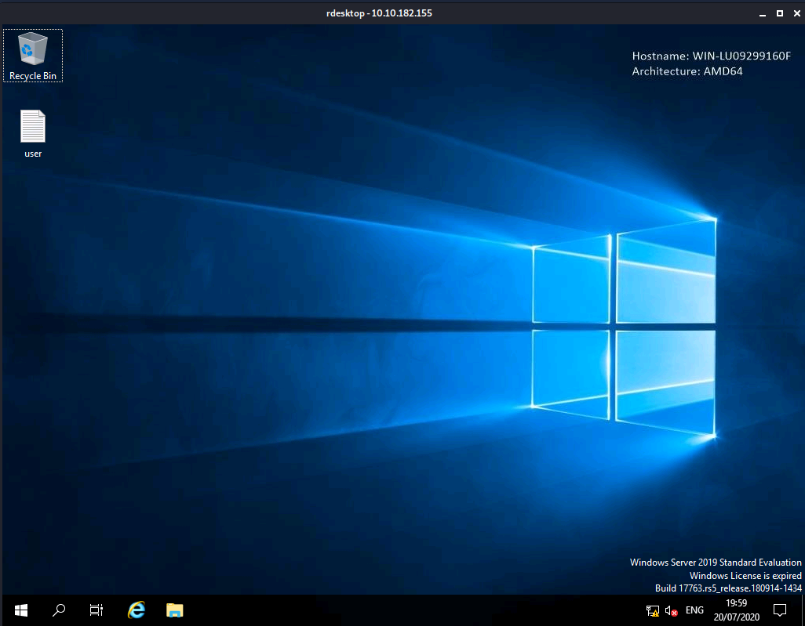

# [TryHackme](https://tryhackme.com/)
## [Anthem](https://tryhackme.com/room/anthem) 


### Task 1 Website Analysis

#1 Let's run nmap and check what ports are open.
```
No answer needed
```

#2 What port is for the web server?
```
nmap scans
```

#3 What port is for remote desktop service?
```
nmap scans
```

#4 What is a possible password in one of the pages web crawlers check for?
```
robots.txt
```

#5 What CMS is the website using?
```
robots.txt
```

#6 What is the domain of the website? 
```
anthem.com
```

#7 What's the name of the Administrator
```
There is a poem in that website on pasting that poem in google I found a name he seems to be administrator
```

#8 Can we find find the email address of the administrator?
```
As per the hint I found Jane Doe's email as JD@anthem.com simillary admin woucd have **@anthem.com
```
## Task 2  Spot The Flags
#1 Flag 1
#2 Flag 2
#3 Flag 3
#4 Flag 4
```
View Source of all the pages
```

## Task 3

`rdesktop <machine_IP>`

**On logging in with the above username and passwords the one I found in task 1**



#2 Gain initial access to the machine, what is the contents of user.txt?
```
On desktop I got the user.txt
```
#3 Can we spot the admin password
```
As the hint goes I enabled show hidden files and on C:/> I saw backup folder with restore.txt. But we don't have permission to access that file but luckily we can change its properties so I did and added my user and tada now we can read that file which is the root passwd 
```

#4 Escalate your privileges to root, what is the contents of root.txt?

```
Moving to C:/Users/Administrator/Desktop

there is our root.txt
```